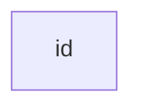
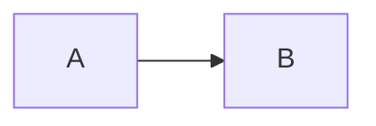
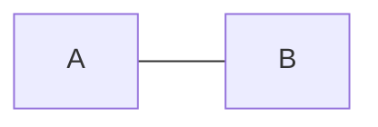
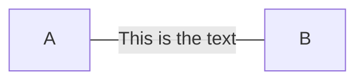

# Markdown 的使用

## 编辑器

1. [](https://typora.io)

    所编即所得，是当前非常热门的Markdown编辑器

2. [](https://code.visualstudio.com/)

    Visual Studio Code，需要一些配置，但也十分的简单易用。

## Markdown 基本语法

总述：Markdown 是一种轻量级的标记语言，排班语法简介，让人更容易关注内容本身而非排版，它使用易读易写的纯文本格式编写文档，可与HTML混编，可导出 HTML、PDF 以及本身的 .md 格式的文件。因简洁、高效、易读、易写，Markdown被大量使用，如Github、Wikipedia等网站，如各大博客平台：CSDN、博客园、简书等。

「标记」、「语言」等听起来很高大上，实则在Markdown中非常简单，你只需要记住不超过十个标记就能处理日常中的大多数事务。这将大大提升你的工作效率。

本文仅供学习参考用途，参考网站有：

1. [Markdown 基本语法 | Markdown 语法教程](https://markdown.com.cn/basic-syntax/)

### 标题

要创建标题，请在单词或短语前面添加井号 (`#`) 。`#` 的数量代表了标题的级别。例如，添加三个 `#` 表示创建一个三级标题 (`<h3>`) (例如：`### My Header`)。

| Markdown语法             | HTML                       | 预览效果                 |
| ------------------------ | -------------------------- | ------------------------ |
| `# Heading level 1`      | `<h1>Heading level 1</h1>` | <h1>Heading level 1</h1> |
| `## Heading level 2`     | `<h2>Heading level 2</h2>` | <h2>Heading level 2</h2> |
| `### Heading level 3`    | `<h3>Heading level 3</h3>` | <h3>Heading level 3</h3> |
| `#### Heading level 4`   | `<h4>Heading level 4</h4>` | <h4>Heading level 4</h4> |
| `##### Heading level 5`  | `<h5>Heading level 5</h5>` | <h5>Heading level 5</h5> |
| `###### Heading level 6` | `<h6>Heading level 6</h6>` | <h6>Heading level 6</h6> |

不同的 Markdown 应用程序处理 `#` 和标题之间的空格方式并不一致。为了兼容考虑，请用一个空格在 `#` 和标题之间进行分隔。

| ✅ Do this            | ❌ Don't do this     |
| -------------------- | ------------------- |
| `# Here's a Heading` | `#Here's a Heading` |

### 段落

要创建段落，请使用空白行将一行或多行文本进行分隔。

| Markdown语法                                                 | HTML                                                         | 预览效果                                                     |
| ------------------------------------------------------------ | ------------------------------------------------------------ | ------------------------------------------------------------ |
| `I really like using Markdown.`<br /><br />`I think I'll use it to format all of my documents from now on.` | `<p>I really like using Markdown.</p>`<br /><br />`<p>I think I'll use it to format all of my documents from now on.</p>` | I really like using Markdown.<br /><br />I think I'll use it to format all of my documents from now on. |

不要用空格（spaces）或制表符（ tabs）缩进段落。在Markdown渲染时并不会显示缩进。

### 换行

在一行的末尾添加两个或多个空格，然后按回车键，即可创建一个换行(`<br>`)。

| Markdown语法                                                 | HTML                                                         | 预览效果                                                   |
| ------------------------------------------------------------ | ------------------------------------------------------------ | ---------------------------------------------------------- |
| `This is the first line. `<br />` And this is the second line.` | `<p>This is the first line.`<br>`<br>`<br />`And this is the second line.</p>` | This is the first line. <br />And this is the second line. |

几乎每个 Markdown 应用程序都支持两个或多个空格进行换行，称为 `结尾空格（trailing whitespace)` 的方式，但这是有争议的，因为很难在编辑器中直接看到空格，并且很多人在每个句子后面都会有意或无意地添加两个空格。由于这个原因，你可能要使用除结尾空格以外的其它方式来换行。幸运的是，几乎每个 Markdown 应用程序都支持另一种换行方式：HTML 的 `<br>` 标签。

为了兼容性，请在行尾添加“结尾空格”或 HTML 的 `<br>` 标签来实现换行。

### 强调

#### 粗体

要加粗文本，请在单词或短语的前后各添加两个星号（asterisks）或下划线（underscores）。如需加粗一个单词或短语的中间部分用以表示强调的话，请在要加粗部分的两侧各添加两个星号（asterisks）。

```markdown
**strongcontent**
__strongcontent__
stro**ngc**ontent
```

**strongcontent**

__strongcontent__

stro**ngc**ontent

> Markdown 应用程序在如何处理单词或短语中间的下划线上并不一致。为兼容考虑，在单词或短语中间部分加粗的话，请使用星号（asterisks）`*`。

#### 斜体

要用斜体显示文本，请在单词或短语前后添加一个星号（asterisk）或下划线（underscore）。要斜体突出单词的中间部分，请在字母前后各添加一个星号，中间不要带空格。

```markdown
*Italiccontent*
_Italiccontent_
Itali*cco*ntent
```

*Italiccontent*

_Italiccontent_

Itali*cco*ntent

>与加粗一样，要用斜体突出单词的中间部分，请使用星号（asterisks）`*`。

#### 粗体与斜体

要同时用粗体和斜体突出显示文本，请在单词或短语的前后各添加三个星号或下划线。要加粗并用斜体显示单词或短语的中间部分，请在要突出显示的部分前后各添加三个星号，中间不要带空格。

```markdown
This ***text*** is really important.
This ___text___ is really important.
This __*text*__ is really important.
This **_text_** is really important.
This t***ex***t is really important.
```

This ***text*** is really important.

This ___text___ is really important.

This __*text*__ is really important.

This **_text_** is really important.

This t***ex***t is really important.

>Markdown 应用程序在处理单词或短语中间添加的下划线上并不一致。为了实现兼容性，请使用星号将单词或短语的中间部分加粗并以斜体显示，以示重要。

### 引用

要创建块引用，请在段落前添加一个 `>` 符号。

```markdown
> Dorothy followed her through many of the beautiful rooms in her castle.
```

渲染效果如下所示：

> Dorothy followed her through many of the beautiful rooms in her castle.

#### 多个段落的块引用

块引用可以包含多个段落。为段落之间的空白行添加一个 `>` 符号。

```markdown
> Dorothy followed her through many of the beautiful rooms in her castle.
>
> The Witch bade her clean the pots and kettles and sweep the floor and keep the fire fed with wood.
```

渲染效果如下：

> Dorothy followed her through many of the beautiful rooms in her castle.
>
> The Witch bade her clean the pots and kettles and sweep the floor and keep the fire fed with wood.

#### 嵌套块引用

块引用可以嵌套。在要嵌套的段落前添加一个 `>>` 符号。

```markdown
> Dorothy followed her through many of the beautiful rooms in her castle.
>
>> The Witch bade her clean the pots and kettles and sweep the floor and keep the fire fed with wood.
```

渲染效果如下：

> Dorothy followed her through many of the beautiful rooms in her castle.
>
> > The Witch bade her clean the pots and kettles and sweep the floor and keep the fire fed with wood.

#### 带有其它元素的块引用

块引用可以包含其他 Markdown 格式的元素。并非所有元素都可以使用，你需要进行实验以查看哪些元素有效。

```markdown
> #### The quarterly results look great!
>
> - Revenue was off the chart.
> - Profits were higher than ever.
>
>  *Everything* is going according to **plan**.
```

渲染效果如下：

> #### The quarterly results look great!
>
> - Revenue was off the chart.
> - Profits were higher than ever.
>
> *Everything* is going according to **plan**.

### 列表

可以将多个条目组织成有序或无序列表。

#### 有序列表

```markdown
1. First item
2. Second item
3. Third item
4. Fourth item
```

1. First item
2. Second item
3. Third item
4. Fourth item

>请确保有序列表序号中的点是英文格式的点，另外请不要使用 1、, 1) 等格式。

#### 无序列表

要创建无序列表，请在每个列表项前面添加破折号 (-)、星号 (*) 或加号 (+) 。缩进一个或多个列表项可创建嵌套列表。

```markdown
- First item
- Second item
- Third item
- Fourth item

- First item
- Second item
- Third item
    - Indented item
    - Indented item
- Fourth item
```

- First item
- Second item
- Third item
- Fourth item


- First item
- Second item
- Third item
    - Indented item
    - Indented item
- Fourth item

#### 在列表中嵌套其他元素

要在保留列表连续性的同时在列表中添加另一种元素，请将该元素缩进四个空格或一个制表符，如下例所示：

##### 段落

```markdown
*   This is the first list item.
*   Here's the second list item.

    I need to add another paragraph below the second list item.

*   And here's the third list item.
```

* This is the first list item.

* Here's the second list item.

    I need to add another paragraph below the second list item.

* And here's the third list item.

##### 引用块

```markdown
*   This is the first list item.
*   Here's the second list item.

    > A blockquote would look great below the second list item.

*   And here's the third list item.
```

* This is the first list item.

* Here's the second list item.

    > A blockquote would look great below the second list item.

* And here's the third list item.

##### 代码块

```markdown
1.  Open the file.
2.  Find the following code block on line 21:
	```html
    <html>
    <head>
        <title>Test</title>
    </head>
```

3.  Update the title to match the name of your website.

```
1.  Open the file.
2.  Find the following code block on line 21:
	```html
    <html>
    <head>
    	<title>Test</title>
    </head>
```

3.  Update the title to match the name of your website.

##### 图片

```markdown
1.  Open the file containing the Linux mascot.
2.  Marvel at its beauty.

    

3.  Close the file.
```

1. Open the file containing the Linux mascot.

2. Marvel at its beauty.

    

3. Close the file.

##### 列表

```markdown
1. First item
2. Second item
3. Third item
    - Indented item
    - Indented item
4. Fourth item
```

1. First item
2. Second item
3. Third item
    - Indented item
    - Indented item
4. Fourth item

### 代码

要将单词或短语表示为代码，请将其包裹在反引号 (`` `) 中。

```markdown
At the command prompt, type `nano`.
```

At the command prompt, type `nano`.

#### 转义反引号

如果你要表示为代码的单词或短语中包含一个或多个反引号，则可以通过将单词或短语包裹在双反引号(``` `)中。

```markdown
``Use `code` in your Markdown file.``
```

``Use `code` in your Markdown file.``

#### 代码块

Markdown基本语法允许您通过将行缩进四个空格或一个制表符来创建代码块。但这种写法不方便，可以直接用两个 `` ``` `` 进行包裹

````markdown
```
{
  "firstName": "John",
  "lastName": "Smith",
  "age": 25
}
​```
````

呈现出的效果如下：

```
{
  "firstName": "John",
  "lastName": "Smith",
  "age": 25
}
```

若想要语法高亮，可以在反引号后指定语言

```markdown
```json
{
  "firstName": "John",
  "lastName": "Smith",
  "age": 25
}
​```
```

```json
{
  "firstName": "John",
  "lastName": "Smith",
  "age": 25
}
```

### 分割线

要创建分隔线，请在单独一行上使用三个或多个星号 (`***`)、破折号 (`---`) 或下划线 (`___`) ，并且不能包含其他内容。

```markdown
***

---

---------------
```

呈现样式如下：

---

为了兼容性，请在分隔线的前后均添加空白行。

```markdown
Try to put a blank line before...

---

...and after a horizontal rule.
```


### 链接

链接文本放在中括号内，链接地址放在后面的括号中，链接title可选。

超链接Markdown语法代码：`[超链接显示名](超链接地址 "超链接title")`

对应的HTML代码：`<a href="超链接地址" title="超链接title">超链接显示名</a>`

```text
这是一个链接 [Markdown语法](https://markdown.com.cn)。
```

渲染效果如下：

这是一个链接 [Markdown语法](https://markdown.com.cn/)。

链接的更多应用请戳：[Markdown 链接语法](https://markdown.com.cn/basic-syntax/links.html)

>不同的 Markdown 应用程序处理URL中间的空格方式不一样。为了兼容性，请尽量使用%20代替空格。
>
>`[link](https://www.example.com/my%20great%20page)`

### 图片

插入图片Markdown语法代码：``。

对应的HTML代码：``

```markdown

```


#### 链接图片

给图片增加链接，请将图像的Markdown 括在方括号中，然后将链接添加在圆括号中。

```markdown
[](https://typora.io)
```

渲染效果如下：

[](https://typora.io)

### 转义字符语法

要显示原本用于格式化 Markdown 文档的字符，请在字符前面添加反斜杠字符 (`\`) 。

```text
\* Without the backslash, this would be a bullet in an unordered list.
```

渲染效果如下：

\* Without the backslash, this would be a bullet in an unordered list.

#### 可做转义的字符

以下列出的字符都可以通过使用反斜杠字符从而达到转义目的。

| Character | Name                                                         |
| --------- | ------------------------------------------------------------ |
| \         | backslash                                                    |
| `         | backtick (see also [escaping backticks in code](https://markdown.com.cn/basic-syntax/escaping-characters.html#escaping-backticks)) |
| *         | asterisk                                                     |
| _         | underscore                                                   |
| { }       | curly braces                                                 |
| [ ]       | brackets                                                     |
| ( )       | parentheses                                                  |
| #         | pound sign                                                   |
| +         | plus sign                                                    |
| -         | minus sign (hyphen)                                          |
| .         | dot                                                          |
| !         | exclamation mark                                             |
| \|        | pipe (see also [escaping pipe in tables](https://markdown.com.cn/extended-syntax/escaping-pipe-characters-in-tables.html)) |

---

## Markdown 扩展语法

### 表格

要添加表，请使用三个或多个连字符（`---`）创建每列的标题，并使用管道（`|`）分隔每列。您可以选择在表的任一端添加管道。

```markdown
| Syntax      | Description |
| ----------- | ----------- |
| Header      | Title       |
| Paragraph   | Text        |
```

| Syntax    | Description |
| --------- | ----------- |
| Header    | Title       |
| Paragraph | Text        |

单元格宽度可以变化，如下所示。呈现的输出将看起来相同。

```markdown
| Syntax | Description |
| --- | ----------- |
| Header | Title |
| Paragraph | Text |
```

| Syntax    | Description |
| --------- | ----------- |
| Header    | Title       |
| Paragraph | Text        |

可以使用该网站加快表格的创建：[Markdown Tables Generator](https://www.tablesgenerator.com/markdown_tables)

#### 对齐

您可以通过在标题行中的连字符的左侧，右侧或两侧添加冒号（`:`），将列中的文本对齐到左侧，右侧或中心。

```text
| Syntax      | Description | Test Text     |
| :---        |    :----:   |          ---: |
| Header      | Title       | Here's this   |
| Paragraph   | Text        | And more      |
```

呈现的输出如下所示：

| Syntax    | Description |   Test Text |
| :-------- | :---------: | ----------: |
| Header    |    Title    | Here’s this |
| Paragraph |    Text     |    And more |

#### 格式化表格中的文字

您可以在表格中设置文本格式。例如，您可以添加链接，代码（仅反引号（```）中的单词或短语，**而不是代码块**）和强调。

**您不能添加标题，块引用，列表，水平规则，图像或HTML标签。**

#### 在表中转义管道字符

您可以使用表格的HTML字符代码（`&#124`）在表中显示竖线（`|`）字符。

### 脚注

脚注使您可以添加注释和参考，而不会使文档正文混乱。当您创建脚注时，带有脚注的上标数字会出现在您添加脚注参考的位置。读者可以单击链接以跳至页面底部的脚注内容。

要创建脚注参考，请在方括号（`[^1]`）内添加插入符号和标识符。标识符可以是数字或单词，但不能包含空格或制表符。标识符仅将脚注参考与脚注本身相关联-在输出中，脚注按顺序编号。

在括号内使用另一个插入符号和数字添加脚注，并用冒号和文本（`[^1]: My footnote.`）。您不必在文档末尾添加脚注。您可以将它们放在除列表，块引号和表之类的其他元素之外的任何位置。

~~~markdown
Here's a simple footnote,[^1] and here's a longer one.[^bignote]

[^1]: This is the first footnote.

[^bignote]: Here's one with multiple paragraphs and code.

```
Indent paragraphs to include them in the footnote.

`{ my code }`

Add as many paragraphs as you like.
```
~~~

呈现的输出如下：

Here's a simple footnote,[^1] and here's a longer one.[^bignote]

[^1]: This is the first footnote.

[^bignote]: Here's one with multiple paragraphs and code.

```
Indent paragraphs to include them in the footnote.

`{ my code }`

Add as many paragraphs as you like.
```

### 标题编号

许多Markdown处理器支持[标题](https://markdown.com.cn/basic-syntax/headings.html)的自定义ID - 一些Markdown处理器会自动添加它们。添加自定义ID允许您直接链接到标题并使用CSS对其进行修改。要添加自定义标题ID，请在与标题相同的行上用大括号括起该自定义ID。

```markdown
### My Great Heading {#custom-id}
```

对应的HTML代码：

```markdwon
<h3 id="custom-id">My Great Heading</h3>
```

通过创建带有数字符号（`#`）和自定义标题ID的[标准链接]((/basic-syntax/links.html)，可以链接到文件中具有自定义ID的标题。

| Markdown                      | HTML                                     | 预览效果                                                     |
| ----------------------------- | ---------------------------------------- | ------------------------------------------------------------ |
| `[Heading IDs](#heading-ids)` | `<a href="#heading-ids">Heading IDs</a>` | [Heading IDs](https://markdown.com.cn/extended-syntax/heading-ids.html#heading-ids) |

其他网站可以通过将自定义标题ID添加到网页的完整URL（例如`[Heading IDs](https://markdown.com.cn/extended-syntax/heading-ids.html#headid)`）来链接到标题。

### 删除线

您可以通过在单词中心放置一条水平线来删除单词。结果看起来像这样。此功能使您可以指示某些单词是一个错误，并不表示要包含在文档中。若要删除单词，请`~~`在单词前后使用两个波浪号。

```text
~~世界是平坦的。~~ 我们现在知道世界是圆的。
```

呈现的输出如下所示：

~~世界是平坦的。~~ 我们现在知道世界是圆的。

### 任务列表

任务列表使您可以创建带有复选框的项目列表。在支持任务列表的Markdown应用程序中，复选框将显示在内容旁边。要创建任务列表，请在任务列表项之前添加破折号（`-`）和方括号，并`[ ]`在其前面加上空格。要选择一个复选框，请x在方括号（`[x]`）之间添加in 。

```text
- [x] Write the press release
- [ ] Update the website
- [ ] Contact the media
```

呈现的输出如下所示：

- [x] Write the press release
- [ ] Update the website
- [ ] Contact the media

### 使用Emoji表情

有两种方法可以将表情符号添加到Markdown文件中：将表情符号复制并粘贴到Markdown格式的文本中，或者键入*emoji shortcodes*。

#### 复制和粘贴表情符号

在大多数情况下，您可以简单地从[Emojipedia](https://emojipedia.org/) 等来源复制表情符号并将其粘贴到文档中。许多Markdown应用程序会自动以Markdown格式的文本显示表情符号。从Markdown应用程序导出的HTML和PDF文件应显示表情符号。

**Tip:** 如果您使用的是静态网站生成器，请确保将HTML页面编码为UTF-8。.

#### 使用表情符号简码

一些Markdown应用程序允许您通过键入表情符号短代码来插入表情符号。这些以冒号开头和结尾，并包含表情符号的名称。

```text
去露营了！ :tent: 很快回来。

真好笑！ :joy:
```

呈现的输出如下所示：

去露营了！⛺很快回来。

真好笑！😂

其他表情符号请戳：[表情符号](https://blog.csdn.net/weixin_42395140/article/details/111642339)

### 折叠

```html
<details>
<summary>展开</summary>
这是展开后的内容
</details>
```

<details>
<summary>展开</summary>
这是展开后的内容
</details>


### 目录

markdown支持生成目录，部分博客网站也支持。

`[TOC]`

## Markdown扩展应用

### mermaid 

通过 mermaid 可以实现以纯文本的方式绘制流程图，饼图、序列图，甘特图等。目前 Typora 已支持。本文目前仅记录流程图、饼图、甘特图的基本用法。

```markdown
```mermaid
graph TD; 
A-->B; 
A-->C; 
B-->D; 
C-->D; 
​``` 
```


#### 流程图

首先使用 mermaid 在三个 ```` `后进行标识，所有的流程图需要以 `graph` 开头。

##### 图表方向

`graph` 后紧跟的是图标的方向。

`T`  对应 Top，`B` 对应Bottom，`L` 对应 Left，`R` 对应 Right。

- TB 从上到下
- BT 从下到上
- RL 从右到左
- LR 从左到右
- TD 与 TB 一样，从上到下

##### 节点形状

###### 默认节点

```markdown
``` mermaid
graph TB 
    id 
​``` 
```



###### 带文字说明的结点

```markdown
```mermaid
graph LR
	id1[This is the text in the box]
​```
```


###### 带圆角文字说明的结点

```markdown
```mermaid
graph LR
	id1(This is the text in the box)
​```
```


###### 带文字说明的圆形结点

```markdown
```mermaid
graph LR
	id1((This is the text in the box))
​```
```


###### 带文字说明的飘带结点

```markdown
```mermaid
graph LR
	id>This is the text in the box]
​```
```


###### 带文字说明的菱形结点

```markdown
```mermaid
graph LR
	id{This is the text in the box}
​```
```


##### 结点间的连线

###### 带箭头的线

```markdwon
```mermaid
graph LR
	A --> B
​```
```



###### 没有任何修饰的线

```markdown
```mermaid
graph LR
	A --- B
​```
```



###### 在线上有描述文字的线

```markdwon
```mermaid
graph LR
	A-- This is the text ---B
​```

或者 

​```mermaid
graph LR
	A---|This is the text|B
​```
```



```mermaid
graph LR
	A---|This is the text|B
```

###### 有箭头同时带上文字描述的线

```markdown
```mermaid
graph LR
	A-->|text|B
​```
或者
​```mermaid
graph LR
	A-- text -->B
​```
```

```mermaid
graph LR
	A-->|text|B
```

或者

```mermaid
graph LR
	A-- text -->B
```

###### 点状线

```markdown
```mermaid
graph LR
	A-.->B
​```
```

```mermaid
graph LR
	A-.->B
```

###### 加粗的线

```markdown
```mermaid
graph LR
	A ==> B
​```
```

```mermaid
graph LR
	A ==> B
```

带有文字加粗的线类似，只需要把 `-` 换成 `=` 即可。

##### 子图表

```markdwon
subgraph 子图表名称 
    子图表中的描述语句... 
end
```

示例

```markdwon
``` mermaid
graph TB 
    c1-->a2 
    subgraph one 
    	a1-->a2 
    end 
    subgraph two 
    	b1-->b2 
    end 
    subgraph three 
    	c1-->c2 
    end 
​``` 
```

``` mermaid
graph TB 
    c1-->a2 
    subgraph one 
    a1-->a2 
    end 
    subgraph two 
    b1-->b2 
    end 
    subgraph three 
    c1-->c2 
    end 
```

##### 示例

```markdown
```mermaid
graph TB;
subgraph 分情况
A(开始)-->B{判断}
end
B--第一种情况-->C[第一种方案]
B--第二种情况-->D[第二种方案]
B--第三种情况-->F{第三种方案}
subgraph 分种类
F--第1个-->J((测试圆形))
F--第2个-->H>右向旗帜形]
end
H---I(测试完毕)
C--票数100---I(测试完毕)
D---I(测试完毕)
J---I(测试完毕)
​```
```

```mermaid
graph TB;
subgraph 分情况
A(开始)-->B{判断}
end
B--第一种情况-->C[第一种方案]
B--第二种情况-->D[第二种方案]
B--第三种情况-->F{第三种方案}
subgraph 分种类
F-.第1个.->J((测试圆形))
F-.第2个.->H>右向旗帜形]
end
H---I(测试完毕)
C--票数100---I(测试完毕)
D---I(测试完毕)
J---I(测试完毕)
```

#### 饼图

语法比较简单，不做过多介绍

```markdown
```mermaid
pie
 title Pie Chart
 "Dogs" : 386
 "cats" : 567
 "rabbit" : 700
 "pig":365
 "tiger" : 15
​```
```

```mermaid
pie
 title Pie Chart
 "Dogs" : 386
 "cats" : 567
 "rabbit" : 700
 "pig":365
 "tiger" : 15
```


#### 甘特图

dateFormat 指定日期格式

section 为项目关键字，空格之后输入项目名称。

section后的每一行为任务行，任务名称后跟以` :` 开头的任务属性。

在任务属性中，常用的有：

1. 任务状态：done、active、crit，分别表示已完成、正在进行、关键任务。如果不加任何状态，默认为待完成状态

2. 任务描述：在下面的示例代码中，desc1、desc2就是任务描述，建议给每个任务都加上描述。`desc6,after desc3` 表示时间上`desc6 紧跟在 desc3` 之后。

3. 任务时长

    1. 时间范围：2021-01-06,2021-01-08
    2. 指定天数 如：5d
    3. 指定周数 如：3w
    4. 指定开始日期+天数 如：2021-01-06，5d

    

```markdown
```mermaid
gantt
 dateFormat  YYYY-MM-DD
 title     软件开发任务进度安排 

 section 软硬件选型 
 硬件选择      :done,desc1, 2020-01-01,6w 
 软件设计      :active,desc2, after desc1,3w

 section 编码准备
 软件选择       :crit,done,desc3,2020-01-01,2020-01-29
 编码和测试软件   :1w
 安装测试系统    :2020-02-12,1w

 section 完成论文
 编写手册      :desc5,2020-01-01,10w
 论文修改      :crit,after desc3,3w
 论文定稿      :after desc5,3w
​```
```

```mermaid
gantt
 dateFormat  YYYY-MM-DD
 title     软件开发任务进度安排 

 section 软硬件选型 
 硬件选择      :done,desc1, 2020-01-01,6w 
 软件设计      :active,desc2, after desc1,3w

 section 编码准备
 软件选择       :crit,done,desc3,2020-01-01,2020-01-29
 编码和测试软件   :1w
 安装测试系统    :2020-02-12,1w

 section 完成论文
 编写手册      :desc5,2020-01-01,10w
 论文修改      :crit,after desc3,3w
 论文定稿      :after desc5,3w
```
