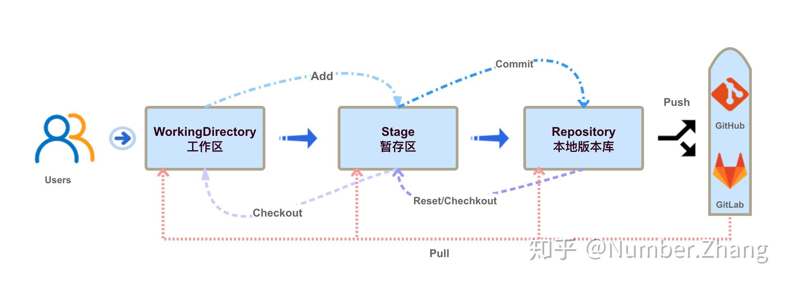

本文为 [Git教程 - 廖雪峰的官方网站 (liaoxuefeng.com)](https://www.liaoxuefeng.com/wiki/896043488029600) 的学习笔记，仅供学习参考之用。

git 是一个版本管理工具，对于个人开发而言，一方面可以记录每次代码的更改，方便回溯代码定位问题；另一方面可以同时开发多个分支，可以更为安全的去折腾新功能。而对于团队开发而言，可以提升协同工作的效率，每个人基于一个共同的代码去开发各自的功能，然后逐步合并到主干分支，如果借助像 github、gitee 这样的网站，合并时代码可以 review，使得代码更加可靠，问题刚方便追溯。

## 安装

- Linux

    ```shell
    sudo apt-get install git # Ubuntu
    ```

- Windows

    https://git-scm.com/downloads

安装完成之后进行配置：

```
git config --global user.name "Your Name"
git config --global user.email "email@example.com"
```

git config 加了 --global 参数表示全局使用该项配置。


## git 工作流程

在讲解 git 的基本使用之前，需要了解一下 git 的工作流程。



在本地文件中，我们创建好一个 git 仓库之后，会有两个区域的概念，分别是工作区和暂存区。你直接在文件中进行添加、修改、删除，只会直接影响工作区。当你使用 add 命令之后，会把文件添加到暂存区，这时这些文件被 git 记录，但还没有形成新的版本。等你这次代码修改结束了，需要将代码迭代至下一个版本时，使用 commit 命令进行提交，这样就在 .git 文件夹中生成了一个新的版本。

你可以使用 git log 来查看提交记录，对应的就是每一个提交的版本。如果你需要将版本提交至远程（github、gitee、gitlab），需要使用 push 命令。

过了一段时间，如果别人对这个代码做了新的迭代，你想要将这些变动同步到你的本地仓库，然后做进一步开发。那么你需要使用 pull 命令。但这时可能会产生代码冲突，因为你本地做了一些额外的修改，那么你需要根据实际情况去解冲突，然后才能继续开发。但一般只有你自己写这个代码时，不会发生冲突。

再假设一种情况，假如你现在对一个 file 文件做了某些更改，你想将它恢复原状，也就是还原。那么你需要根据不同的情况使用不同的命令：

- 如果你想将 file 恢复至暂存区的样子（你之前 add 了，但还没有 commit 的那部分），那么你需要用 `git checkout -- file`。
- 如果你想将 file 恢复至上一个版本（即上一个 commit 时的摸样），那么你需要使用 `git reset HEAD file`，其中 HEAD 特指上一个版本。注意，这样做会也恢复暂存区中的 file 文件。

以上就是 git 的基本工作流程

## 基本使用

- 使用 `git init` 在一个文件夹内部创建 git 管理。目录下生成 .git 目录，该目录是隐藏的，可以使用 `ls -ah` 来查看。

- 使用 `git add <file>` 来添加文件，并使用`git commit -m ''` 来提交文件，其中单引号为本次提交添加注释。其中，如果要添加所有文件，可以使用 `git add -A` 或者 `git add .`。

- 使用 `git status` 来查看当前仓库的状态。可以看到哪些文件被 git 管理、哪些未被管理。另外还可以看到哪些文件做了添加、修改或者删除操作。

- 使用 `git diff` 来查看修改文件的具体内容（相对于上一次 commit）。

- 使用 `git log` 来查看提交日志，加上参数 `--pretty=oneline` 可以简洁化显示。

- 使用`git reset --hard HEAD^` 回退到上一个版本，回退到往上一百个版本需要改成 `HEAD-100`。如需指定版本，使用 `git reset --hard xxxxx`，xxxxx为版本号（可以只写部分前缀）。

- 使用 `git reflog` 来查看命令历史。

- `git checkout -- file` 可以丢弃文件 file 在工作区的修改，如果暂存区有该文件，则回到暂存区的版本，如果暂存区没有，就回到和版本库一样的版本。

- 如果要将暂存区的版本也撤销掉，使用 `git reset HEAD file` ，这样暂存区的内容回退到了工作区。

- `git rm file` 用来删除一个文件（工作区和暂存区都删除），如果删错了，也可以使用上面的 `checkout` 命令回退。如果是只删除暂存区，则使用 `git rm --cached file`。

## 远程仓库

第一步需要在本地创建 SSH key 。一般存放在用户主目录的 .ssh 文件中，如果存在了 `id_rsa` 和 `id_rsa.pub` 文件，则可以跳过这一步。

`ssh-keygen -t rsa -C "youremail@example.com"`

然后将生成的 `id_rsa.pub` 文件里面的内容粘贴到远程仓库的里面（个人设置的公钥设置）

这样远程仓库就可以识别你的本地推送了。

然后在远程创建好 git 仓库，复制好 ssh 地址，类似于：` git@github.com:michaelliao/learngit.git`

在本地git 仓库文件夹下运行：

`git remote add origin git@github.com:michaelliao/learngit.git`

表示将该地址添加到名字为 origin 的remote 中。

然后使用 `git push -u origin master` ，将本地的master分支内容推送到远程新的master 分支，`-u` 参数是将本地的 master 分支与远程关联起来，方便以后操作。再之后的推送可以使用 `git push origin master`

关于本地仓库的远程库地址设置，可以使用 `git remote -v` 查看，如果需要修改，可以使用 `git remote rm <name>` 删除后重新添加。

`git clone <address>` 可以从远处克隆 git 仓库，GitHub给出的地址不止一个，实际上，Git支持多种协议，默认的`git://`使用ssh，但也可以使用`https`等其他协议。使用`https`除了速度慢以外，还有个最大的麻烦是每次推送都必须输入口令，但是在某些只开放http端口的公司内部就无法使用`ssh`协议而只能用`https`。


## 分支管理

使用命令 `git checkout -b dev`  创建一个 dev 分支，并切换到该分支。这是一个组合命令，实际上执行了：`git branch dev` 和 `git checkout dev` 。

使用 `git branch` 来查看所有分支以及当前所在的分支。

假设当前分支在 master，使用 `git merge dev` 可以合并 master 和 dev 分支。当合并方式是 `Fast-forward` 时，合并速度会非常快。

使用 `git branch -d dev` 可以删除 dev 分支。

因为创建、合并和删除分支非常快，所以Git鼓励你使用分支完成某个任务，合并后再删掉分支，这和直接在`master`分支上工作效果是一样的，但过程更安全。

在最新版本的 git 中，支持使用 `git switch -c dev` 来创建并切换到新的分支。使用 `git switch dev` 来切换分支。

当git 无法自动合并分支时，就必须先解决冲突。解决冲突后，再提交，合并完成。用`git log --graph`命令可以看到分支合并图。

如果要禁用 fast-forwad ，可以使用命令 `git merge --no-ff -m "merge with no-ff" dev` 来合并，这次合并将创建一个新的结点。


### 处理 bug

如果当前在 dev 分支上开发，然后正式版本中出了  bug 急需修复，但当前开发的内容还不能commit 到 dev 分支，那么可以先使用 `git stash` 来把工作现场储藏起来，等以后恢复现场继续工作。

```git
git switch master
git switch -c issue-101
...
git add .
git commit -m 'fix'
git switch master
git merge --no-ff -m 'fix' issue-101
```

修好bug之后，切换到 `git switch dev` 继续开发。使用 `git stash list` 查看工作现场列表。

使用 `git stash apply` 来恢复，但内容并没有删除，还需要使用 `git stash drop` 来删除。

另一种是使用 `git stash pop` 来恢复，并删除。（跟栈 pop 类似）

使用 `git stash list` 查看之后，可以使用 `git stash apply stash@{0}` 来指定恢复。

更方便的是，使用 `git cherry-pick <commit_id>` 可以复制一个特定的提交到当前分支。作用是如果在 master 做了修复 bug 的改动，那么在 dev 分支上也需要做。

