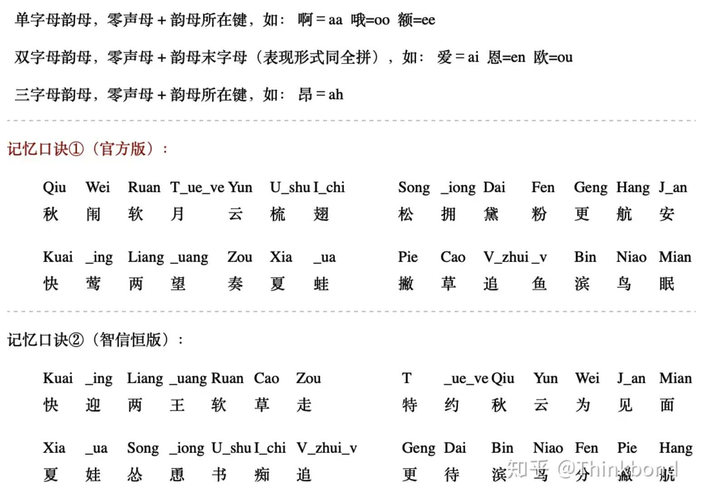

## 键位图

## 记忆口诀

## 练习网站以及参考

- [双拼练习 @ BlueSky](https://api.ihint.me/shuang/)
- [韵母练习](https://www.xiebruce.top/shuangpin-yunmu/)
- [今天，你「双拼」了吗？双拼速成手册](https://zhuanlan.zhihu.com/p/59304620)
- [用了很久的全拼改为双拼值得吗？](https://www.zhihu.com/question/383416202/answer/2584564433)